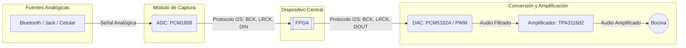
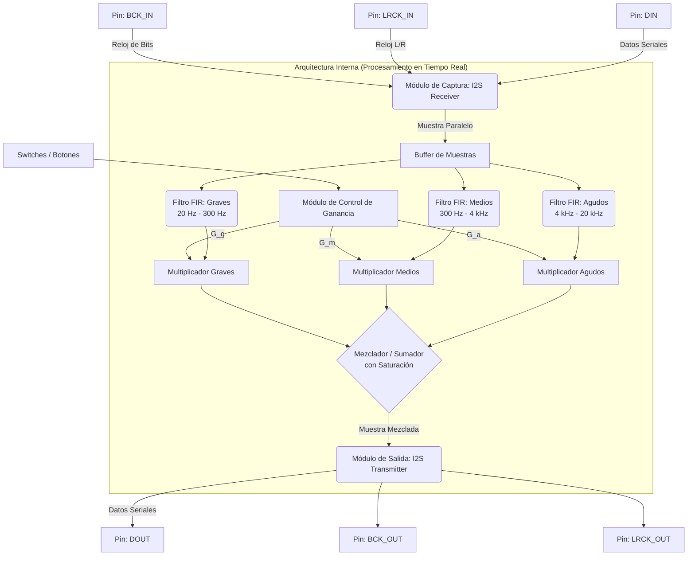

# Procesador Digital de Audio: Ecualizador de 3 Bandas en FPGA

### Diseño Digital VLSI - Proyecto Final 

## 🎯 Objetivo
Diseñar e implementar un sistema de procesamiento digital de audio en FPGA capaz de adquirir una señal de audio, aplicar filtrado digital en tres bandas (graves, medios y agudos), y reproducir la señal procesada en una bocina

## 📋 Especificaciones del Sistema

* **Adquisición de audio:** Uso de un ADC de audio (PCM1808 o equivalente) desde fuentes analógicas (Bluetooth, jack, etc.)
* **Interfaz digital:** Captura de datos mediante interfaz serial de audio I2S (Sincronización con BCK, LRCK y reconstrucción de muestras mono/estéreo)
* **Procesamiento digital:** Ecualizador de 3 bandas mediante filtros digitales (FIR recomendado) con control de ganancia independiente
  * **Graves:** 20 Hz - 300 Hz
  * **Medios:** 300 Hz - 4 kHz
  * **Agudos:** 4 kHz - 20 kHz
* **Salida de audio:** Uso de un DAC de audio (PCM5102A o equivalente) o alternativa (PWM + filtro RC / Red R-2R)
* **Amplificación:** Integración con un amplificador de audio (familia TPA o equivalente) para reproducción en bocina
* **Interfaz de usuario:** Control de ganancia por banda mediante switches o botones

---

## 🛠️ Arquitectura General del Sistema (Hardware)

---

---

## 💻 Arquitectura Interna de la FPGA

